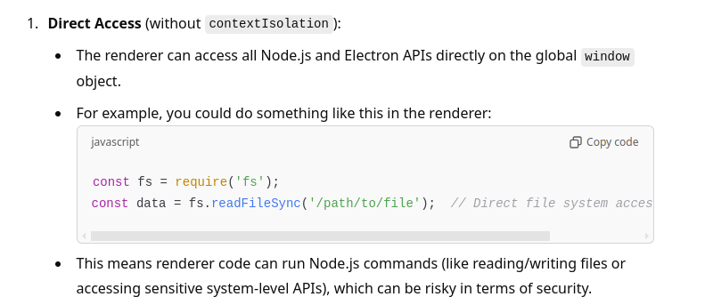
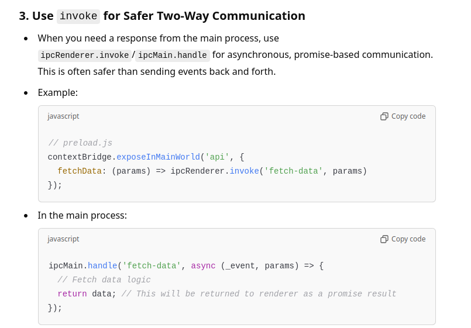

## An Electron application with React and TypeScript

- Changing file extensions in a directory and sub directories
- Working with system files
- Using vite config with electron
- Widely used typescript **type rich**

### Install

```bash
$ npm install
```

### Development

```bash
$ npm run dev
```

### Build

```bash
# For windows
$ npm run build:win

# For macOS
$ npm run build:mac

# For Linux
$ npm run build:linux
```



